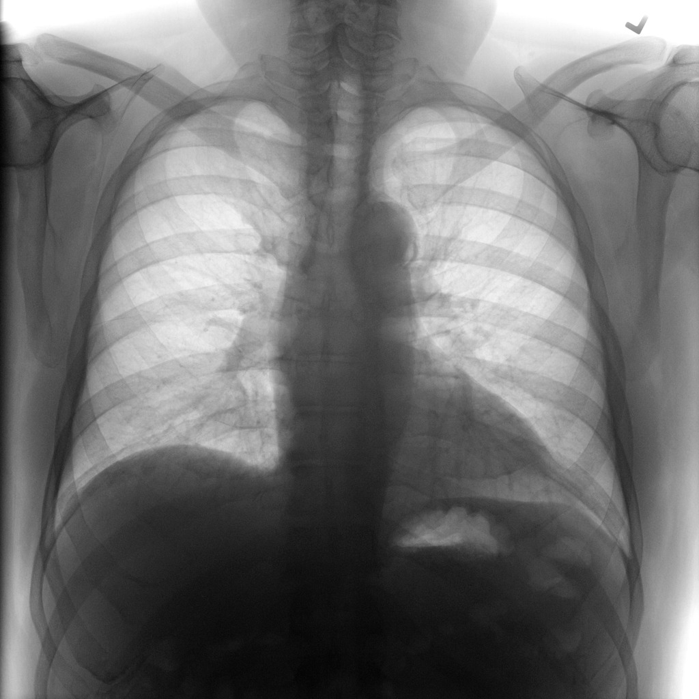
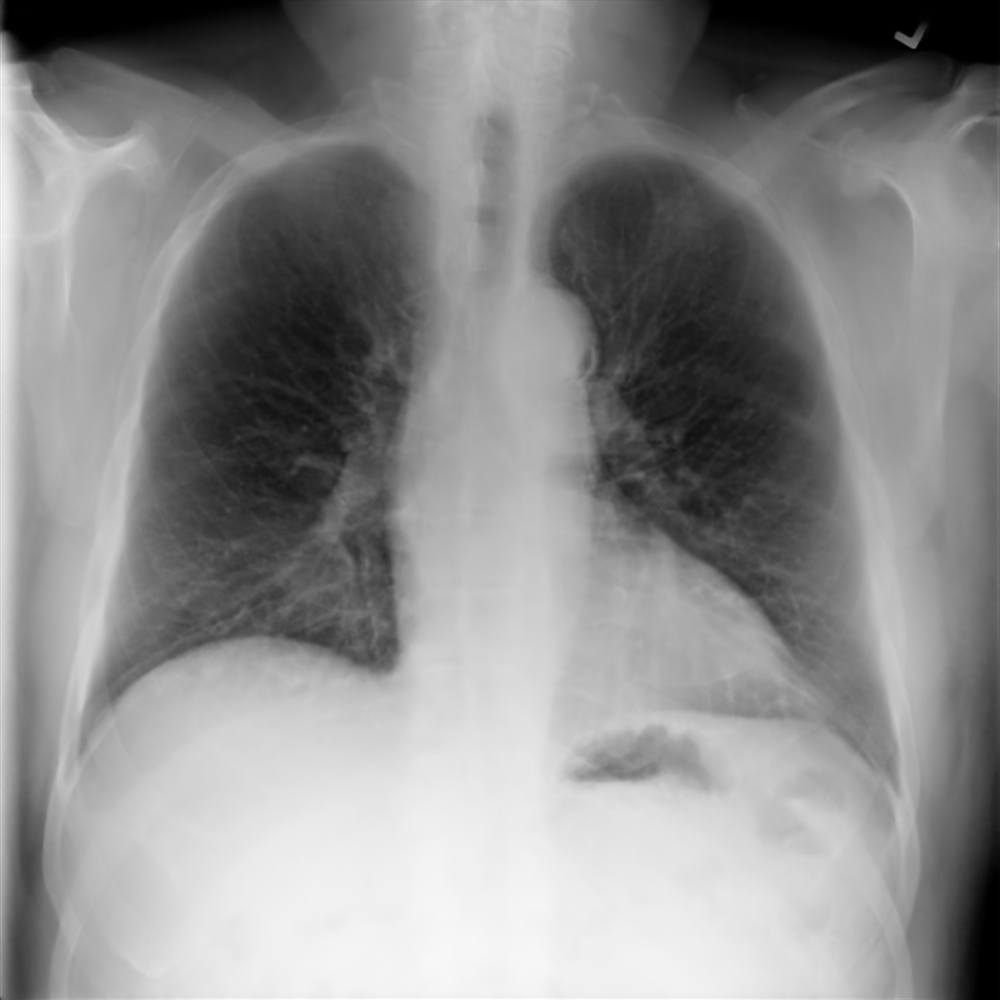
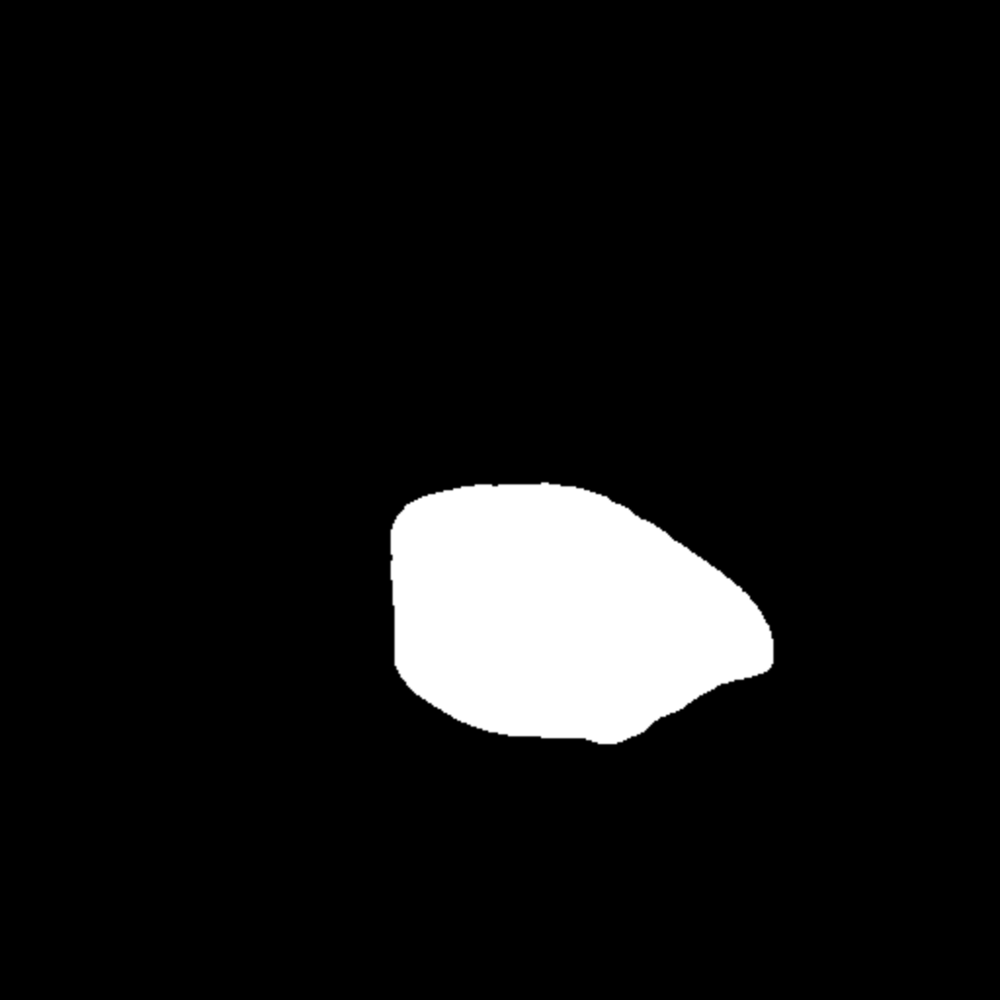
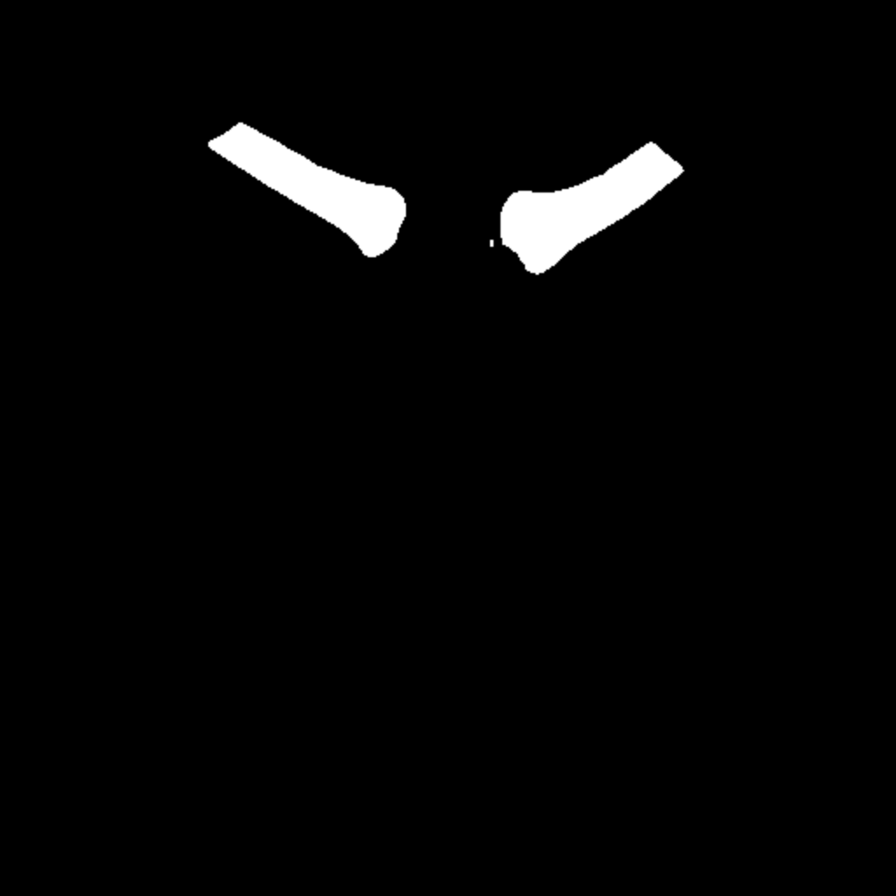

# Lightweight PureLung.

A PyTorch based implementation of modules for suppressing bone shadows, context aware image crop,
image segmentation and auto inverse in the Chest X-ray images. 


Intermediate results:
---------------------

|     Class             |     purelung  0.1b6  |       
|------------------|:------------------------:|
| Original |                                  |
| Positive         |                  | 
| LungCrop with auto inverse        |              |   
| RibSuppression with auto inverse   |                   |
| Segmentation - LUNGS    |                  |   
| Segmentation - HEART    |                  | 
| Segmentation - CLAVICLES    |                  | 
 

#### Extreme angles
Package was [tested](notebooks/extreme.ipynb) with images rotated by 90 and 180 degrees.
 
|                  |     90°                  |          180°                  |         
|------------------|:------------------------:|:------------------------:|
| LungCrop         |           ✓✗                |   ✗         |  
| RibSuppression   |           ✓          |    ✓       |
| Segmentation     |            ✗      |    ✗      |  
| Positive         |            ✓      |    ✗       |

Installation
---------------------
[WIP] You can use pip to install purelung:
```
pip install purelung
```
If you want to get the latest version of the code before it is released on PyPI you can install the library from GitLab:
```
pip install git+https://gitlab.com/internship-2020-ai-lab/super-resolution/augmentations.git
```

CLI reference
---------------------
```
python setup.py develop
```
```
augmentation --type=crop | suppression 
             --file=SOURCE_IMAGE_PATH 
             --result=RESULTANT_IMAGE_PATH 
             [--indent=INDENT]
             [--equalize_out]
             [--auto_inverse]
```
#### Parameters
``` --type  ``` &nbsp; type of an augmentation, either "crop" or "suppression".\
``` --file  ``` &nbsp; path to the source image. \
``` --result ``` &nbsp; path to the resultant image. \
``` --indent ``` &nbsp; indent from the bounding box of detected lungs. Used for crop augmentation.\
``` --equalize ``` &nbsp; flag signalizing that the Histograms Equalization should be performed. Used for suppression augmentation.\
```--auto_inverse``` &nbsp;  flag signalizing that the color inverse of an image should be performed if necessary.

How to use
---------------------
Classes LungCrop, RibSuppression, Segmentation and Positive are Albumentations-integrable, so they can be treated as Albu-classes. The following code snippet demonstrates the composition of the LungCrop and RibSuppression augmentations and their application to an image.
```
import albumentations
from purelung import augmentations

chest_img = auxiliary.read_dcm("path//to//your//image.dcm")
augmentation = albumentations.Compose([augmentations.LungCrop(indent=10, auto_inverse=True),
                                       augmentations.RibSuppression(equalize_out=False, auto_inverse=True)])
augmented = augmentations(image=chest_img)['image']
```
[Getting started with purelung package](notebooks/tutorial.ipynb).

Benchmarking results
---------------------
Results for running the benchmark on first 2000 images from the RSNA dataset using a GeForce GTX 1080 Ti. All outputs are converted to a contiguous NumPy array with the np.uint8 data type. The table shows how many images per second can be processed on a gpu, higher is better.

|                  |     purelung  0.1b6  |       
|------------------|:------------------------:|
| LungCrop         |          5.82249     |   
| RibSuppression   |          0.62893         |
| Segmentation     |            0.21835      |   
| Positive         |            5.25762      |    

Datasets:
---------------------
The impact of developed method on performance of classification evaluated on RSNA Pneumonia dataset (optionally NIH dataset).

1. Chest-xray-pneumonia dataset\
https://www.kaggle.com/paultimothymooney/chest-xray-pneumonia

2. RSNA dataset\
https://www.kaggle.com/c/rsna-pneumonia-detection-challenge

3. Chest-xray-14 dataset\
https://www.kaggle.com/nih-chest-xrays/data

Directory Structure
---------------------
```buildoutcfg
.
├── _data
├── _documents
├── _notebooks
├── _output 
├── _purelung
│   ├── _models
│   │   ├── _inverse
│   │   │   ├── _model_weights
│   │   │   │   ├── __init__.py
│   │   │   │   └── net_weights.pth 
│   │   │   ├── __init__.py 
│   │   │   ├── inverted.py 
│   │   │   └── model.py
│   │   ├── _lungs_finder
│   │   ├── _segmentation
│   │   │   ├── _model_weights
│   │   │   │   ├── __init__.py
│   │   │   │   └── retina_net.pb 
│   │   │   ├── __init__.py 
│   │   │   └── segmentation.py
│   │   ├── _suppression 
│   │   │   ├── _model_weights
│   │   │   │   ├── __init__.py
│   │   │   │   └── unet_resnet1024.pth
│   │   │   ├── bone_suppression_pt.py
│   │   │   ├── common_blocks.py 
│   │   │   └── unet_resnet.py
│   │   └── __init__.py 
│   ├── __init__.py 
│   ├── __main__.py 
│   └── augmentations.py  
├── _scripts
│   ├── __init__.py 
│   ├── benchmark.py  
│   └── console.py
├── _tests
├── LICENSE.md 
├── README.md 
├── requirements.txt
└── setup.py
```
Folder **purelung** contains the core augmentation classes `LungCrop`, `RibSuppression`, `Positive` and `Segmentation`, pre-trained models for lung segmentation, bone suppression and image inverse classification. \
These classes are integrable in the `Albumentation` package and can be used for context-aware image crops and suppressing bone shadows in the Chest X-ray images.
\
Class `LungCrop` utilizes modified [lungs-finder package](https://github.com/dirtmaxim/lungs-finder) located in the **lungs_finder** folder.\
Folder **scripts** contains modules for benchmarking and commad line interaction.


